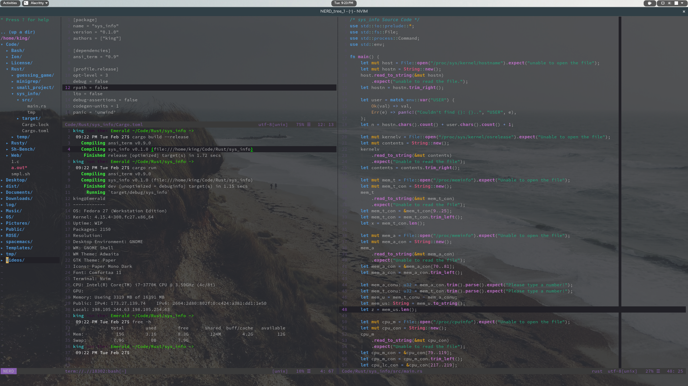
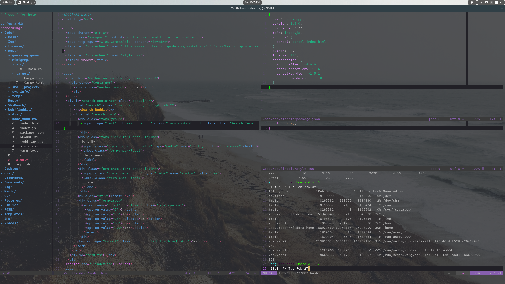
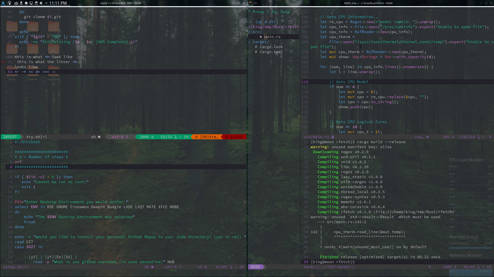

# Neovim Setup for working with Rust #

#### Inspired by [Rustupefy](https://github.com/ivanceras/rustupefy) and Spacemacs ####

## Neovim Setup Requirements ##
* Neovim
* Dein Plugin Manager
* Nerdfont Icons
* Rustup
* RLS

## Recommendations ##

Use a terminal that supports ligatures...

So This..

Looks Like This

### Terminal Support ###
| Works              | Doesn’t work       |
| ------------------ | ------------------ |
| **Butterfly**      | **Alacritty**      |
| **Hyper.app**      | **cmd.exe**        |
| **iTerm 2** ([since 3.1](https://gitlab.com/gnachman/iterm2/issues/3568#note_13118332)) | **Cmder** |
| **Kitty**          | **ConEmu**         |
| **Konsole**        | **GNOME Terminal** | 
| **QTerminal**      | **mate-terminal**  |
| **Terminal.app**   | **mintty**         |
| **Termux**         | **PuTTY**          |
| **Token2Shell/MD** | **rxvt**           |
| **upterm**         | **ZOC** (Windows)  |
| **ZOC** (macOS)    | **gtkterm, guake, LXTerminal, sakura, Terminator, xfce4-terminal,** and other libvte-based terminals ([bug report](https://bugzilla.gnome.org/show_bug.cgi?id=584160)) |

### List of Cool Fonts ###
| Ligature Fonts    | No Ligatures but Awesome |
| ----------------- | ------------------------ |
| **[Fira Code](https://github.com/tonsky/FiraCode) (free)** |  **[IBM Plex Mono](https://github.com/IBM/plex) (free)** |
| **[Hasklig](https://github.com/i-tu/Hasklig) (free)** | **[Hack](https://sourcefoundry.org/hack/) (free)** |
| **[PragmataPro](http://www.fsd.it/fonts/pragmatapro.htm) (€59)** | **[Source Code Pro](https://adobe-fonts.github.io/source-code-pro/) (free)** |
| **[Monoid](http://larsenwork.com/monoid/) (free)** | **[Menlo](https://www.typewolf.com/site-of-the-day/fonts/menlo) (free)**     |
| **[Fixedsys Excelsior](https://github.com/kika/fixedsys) (free)** | **[Monaco](https://gist.github.com/rogerleite/99819) (free)**    |
| **[Iosevka](https://be5invis.github.io/Iosevka/) (free)** |     |
| **[DejaVu Sans Code](https://github.com/SSNikolaevich/DejaVuSansCode) (free)** |        |

## To install Dependecies ##

## Install Rust ##
    curl https://sh.rustup.rs -sSf | sh

### Arch Linux ###
    sudo pacman -S neovim && python2-neovim python-neovim cmake ncurse
    yaourt -S nerd-fonts-complete 
    sudo ln -s /usr/lib/libtinfo.so.6 /usr/lib/libtinfo.so.5
    rustup component add rls-preview rust-analysis rust-src
    
### Debian / Ubuntu ###
    sudo apt-get install neovim python-neovim python3-neovim
    git clone https://github.com/ryanoasis/nerd-fonts.git && cd nerd-fonts && ./install.sh
    rustup component add rls-preview rust-analysis rust-src
    
### Fedora / CentOS 7 / RHEL 7 ###
    sudo dnf install neovim python2-neovim python3-neovim python-devel python3-devel
    git clone https://github.com/ryanoasis/nerd-fonts.git && cd nerd-fonts && ./install.sh
    rustup component add rls-preview rust-analysis rust-src
    
### Gentoo Linux ###
    emerge -a app-editors/neovim
    git clone https://github.com/ryanoasis/nerd-fonts.git && cd nerd-fonts && ./install.sh
    rustup component add rls-preview rust-analysis rust-src
    
### OpenSUSE ###
    sudo zypper in Neovim python-neovim python3-neovim
    git clone https://github.com/ryanoasis/nerd-fonts.git && cd nerd-fonts && ./install.sh
    rustup component add rls-preview rust-analysis rust-src
    
### macOS (Homebrew) ###
    brew install neovim
    git clone https://github.com/ryanoasis/nerd-fonts.git && cd nerd-fonts && ./install.sh
    rustup component add rls-preview rust-analysis rust-src
    
### macOS (Macports) ###
    sudo port selfupdate
    sudo port install neovim
    git clone https://github.com/ryanoasis/nerd-fonts.git && cd nerd-fonts && ./install.sh
    rustup component add rls-preview rust-analysis rust-src
    
## To install Dein Plugin Manager for neovim or vim7.4 and above. ##
    mkdir -p ~/.dein/repos/github.com/Shougo/dein.vim
    git clone https://github.com/Shougo/dein.vim.git ~/.dein/repos/github.com/Shougo/dein.vim

## To install my setup ##
    cd ~/.config/nvim && wget 'https://raw.githubusercontent.com/FriedPandaFries/setup/master/init.vim' && nvim -c 'call dein#install() | q' && cd ~/.dein/repos/github.com/Valloric/YouCompleteMe && ./install.py --rust-completer && nvim -c 'call dein#clear_state() | call dein#recache_runtimepath() | call dein#install() | q' && cd ~

## Features ##

Asynchronous linter via <a href="https://github.com/w0rp/ale">ALE</a>.

Autocompletion via <a href="https://github.com/Valloric/YouCompleteMe">YouCompleteMe</a>.

File Explorer via <a href="https://github.com/scrooloose/nerdtree">nerdtree</a>.

Cursor adjustable splits. Like This

## Visuals ##

Status bar via <a href="https://github.com/vim-airline/vim-airline">Airline</a> with the Violet theme.

Uses <a href="https://github.com/liuchengxu/space-vim-dark">Spacemacs</a> colorscheme.

Uses <a href="https://github.com/Yggdroot/indentLine">indentLine</a> to show indentations.

Uses <a href="https://github.com/ryanoasis/vim-devicons">Vim Dev Icons</a> to show file icons.

Uses transparent background.

## Keymaps ##

<b>Ctrl + T</b> opens terminal in a vertical split

<b>Ctrl + O</b> toggles nerdtree 

<b>Ctrl + S</b> Saves

<b>Ctrl + N</b> open new file

<b>F2</b> Vertical Split

<b>F3</b> Horizontal Split

## One Last Screenshot ##

